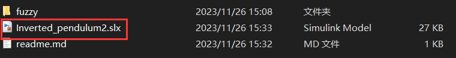
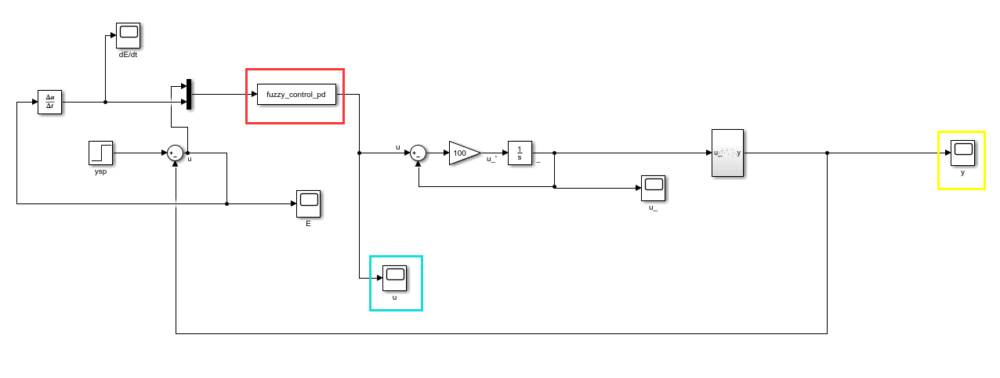
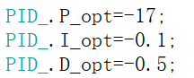

# 如何使用这个工程

你应该可以看到文件夹内的这个simulink模型，它就是倒立摆的仿真模型，双击它以打开

打开后是这样的：

现在你可以直接点击最上方绿色的"run"按钮以运行，不用做其他任何准备工作。如果发生任何问题，请检查你的matlab版本是否为R2019b且安装了全部插件。

**怎么查看运行结果？**

上图中，显示控制信号的示波器用青色方框圈出，显示系统输出的方框用黄色方框圈出。双击以查看示波器图像。

**我想看源码**

实现控制器的S-function在上图中用红色方框圈出，双击它并点击"edit"按钮就可直接打开对应的S-function。

相关脚本文件都存放在'./fuzzy'文件夹中

**你报告里的图是怎么画的？**

使用'./fuzzy/draw,m'，即可一键绘制我报告中的所有图表，点击运行即可。

**修改pid参数初始值**

在'./fuzzy/PID_init.m'中修改这三个数：（P,I,D）初始值。不过最好不要乱改，不然可能控不住。就算要修改，也请确保参数均为负值（对本倒立摆系统而言）

**我想对你的源码做一些修改**

这需要等我完善了注释。或者你可以运用自己的聪明才智去琢磨每一个函数的用法（我至少写了简要的注释，说明了参数和功能）。

但我的建议是：如果你真的想在simulink中应用模糊控制，不如使用simulink自带的模糊控制模块，那个更快，更安全，更方便。

